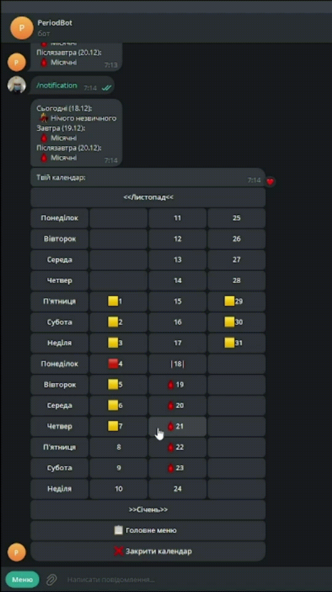

# Period_Bot
Telegram bot that helps you keep track of your periods. Created using Aiogram 3.

## Getting started
<pre>
$ pip install -r requirements.txt
$ python main.py
<kbd>Ctrl</kbd>+<kbd>C</kbd> - to shut down the bot. 
</pre>

## Content
1. [Registration](#Registration)
2. [Notification](#Notification)
3. [Calendar](#Calendar)
4. [Main menu](#main_menu)
5. [Profile menu](#profile_menu)
6. [Emoji menu](#emoji_menu)
7. [Support](#Support)

## **Registration**
To register in bot you need to call the /start command and enter the required data (cycle duration, periods amount and current cycle start)

## **Notification**
After that you receive a notification, you will receive notifications of this type every day.
If you accidentally deleted a notification - you can call it using the /notification command.

## **Calendar**
The calendar can be accessed using the /calendar command.
On the calendar we can view important dates marked both by the bot and by you personally.
Let's try to set several and the remove them.

<a name="main_menu"><h2>Main menu</h2></a>
The main menu can be opened by clicking on the corresponding button or by calling the /menu command
Here we can choose what do we want to do next. 
We can go back to the calendar or move on to the next stage. 

<a name="profile_menu"><h2>Profile menu</h2></a>
In your profile:
1. You can see your data, which the bot calculated for a certain number of cycles;
2. You can set personal statistics and the bot will keep further statistics based on this data;
3. You can set constant data so that the bot calculates the forecast based not on statistics, but on what is convenient for you.

* If you want to delete constant data - just set it 0

<a name="emoji_menu"><h2>Emoji menu</h2></a>
In this menu you can see all your emoji and change them

## **Support**
You can call the /help command to read detailed information about the bot and also the /support command to write a message to the admin.

